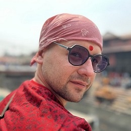

# Alexandr Turdiyev

## Contacts:
- Phone, WhatsApp: +7 700 144 46 22
- E-mail: alexandr.turdiyev@gmail.com 
- GitHub: [AlexandrTurdiyev](https://github.com/AlexandrTurdiyev/)  
- Discord: [Alexandr Turdiyev](https://discordapp.com/users/955026775396741182/) / username: [alexandr_turdiyev](https://discordapp.com/users/955026775396741182/)
- Discord in RS.School server: Alex(AlexandrTurdiyev)
- Telegram: [alexandr_turdiyev](https://t.me/alexandr_turdiyev)
- Instagram: [alexandr.turdiyev](https://www.instagram.com/alexandr.turdiyev?utm_source=qr)

## About me:
I am 30 years old. Born in Almaty, Kazakhstan. One day I left my native country and found myself traveling. I really like to solve various problems related to programming. I study development hard in order to be one of the best specialists in this field.

I am always ready for change and can quickly adapt to any task.

## My skills:
- HTML5/CSS3 - basics.
- JS FE - studying.
- Git - basics.
- VSCode - basics.
- FIGMA - basics.
- AdobeXD - basics.

## Code examples: 
```
function multiply(a, b){
  return a * b
}
```

## Education:
* College: Almaty Technical College
    + Faculty: Computing and software
    + Speciality: Technician-programmer

* Courses:
    + code-basics.com: HTML (Interactive course completed)
    + code-basics.com: CSS (Interactive course completed)
    + code-basics.com: Java Script (In progress)
    + rs.school: JS / FRONT-END (RU) (In progress)

## English and other languages:
- English: beginner.
- Russian: native.
